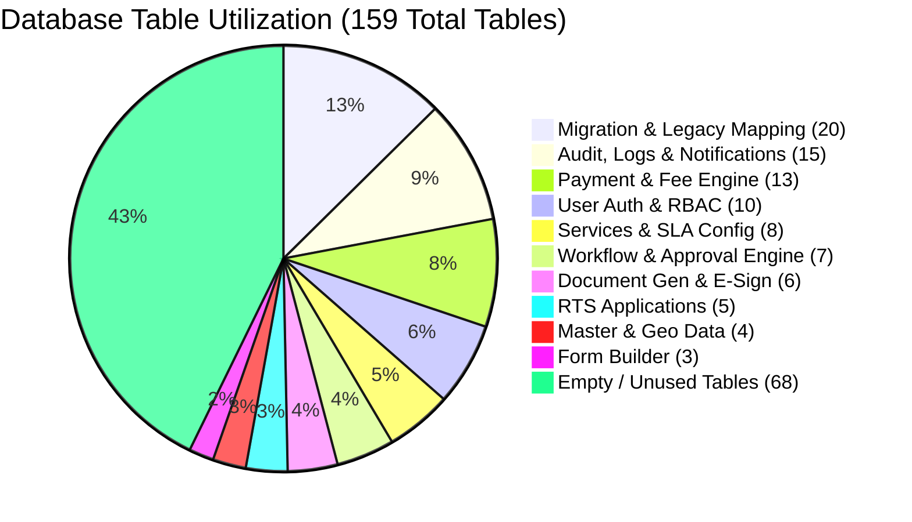
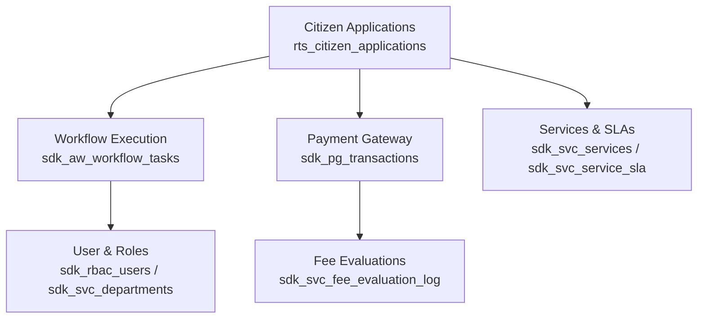

# PMRDA RTS Database (`pmrdarts18_05`) Table & Schema Utility Report

> [!NOTE]
> **Database Host**: `10.9.53.49:5432`  
> **Database Name**: `pmrdarts18_05`  
> **Database Engine**: PostgreSQL 14.24 (Ubuntu 22.04)  
> **Primary Schema**: `public`  
> **Assessment Date**: September 22, 2026  

---

## 1. Executive Summary

A comprehensive structural and data volumetric audit was performed on the primary **PMRDA Right to Services (RTS)** database (`pmrdarts18_05`). The database contains **159 total table structures** in the `public` schema.

* **91 Useful / Active Tables (57.2%)**: Tables populated with live operational data, historical workflow logs, payment transactions, citizen applications, user access control profiles, and master configuration entities. Total row volume exceeds **143,000+ records**.
* **68 Empty / Unused Tables (42.8%)**: Tables containing **0 records**. These represent unlaunched sub-modules (e.g., Slum Management, PMC Care Gardens, Swachh Survekshan), unconfigured platform features (e.g., i18n localization, recurring subscriptions, refunds), or legacy sequence placeholders.

### Key Metrics Summary

| Metric Category | Count / Value | Percentage |
| :--- | :--- | :--- |
| **Total Database Objects (Tables)** | **159** | 100.0% |
| **Active / Useful Tables (> 0 rows)** | **91** | **57.2%** |
| **Empty Tables (0 rows)** | **68** | **42.8%** |
| **Total Database Records (Across Active Tables)** | **~143,450+** | — |
| **Database Schemas Detected** | **1 (`public`)** | — |

---

## 2. Table Distribution & Domain Topology

---

## 3. Useful Tables Breakdown (91 Active Tables)

The **91 active tables** are categorized into 10 core functional domains:

### 3.1. RTS Core Applications & Citizen Services (5 Tables)
Holds core application instances submitted by citizens and officer evaluation records.

| Table Name | Row Count | Columns | Description & Business Purpose |
| :--- | :---: | :---: | :--- |
| `rts_citizen_application_files` | **20,130** | 25 | Uploaded citizen document files, attachments, and binary storage references. |
| `rts_application_document_reviews` | **10,578** | 17 | Document review notes, approval statuses, and officer verification remarks. |
| `rts_citizen_applications` | **3,699** | 43 | **Core Entity**: Primary citizen service application records submitted to PMRDA. |
| `rts_application_sla_notification_log` | **61** | 7 | SLA violation and warning notification events for pending applications. |
| `rts_citizen_application_appeals` | **52** | 21 | Citizen appeals lodged against rejected or delayed service applications. |

---

### 3.2. Workflow & Approval Engine (`sdk_aw_*`) (7 Tables)
Powers state machine transitions, officer task queues, and stage approvals.

| Table Name | Row Count | Columns | Description & Business Purpose |
| :--- | :---: | :---: | :--- |
| `sdk_aw_workflow_tasks` | **7,711** | 25 | **Core Entity**: Active and completed officer action tasks across all departments. |
| `sdk_aw_workflow_instances` | **4,013** | 22 | Workflow instance execution tracking per application. |
| `sdk_aw_workflow_audit_logs` | **3,667** | 14 | Audit history of state changes, reassignments, and stage completions. |
| `sdk_aw_task_comments` | **722** | 9 | Detailed comments and note logs added by reviewing officers. |
| `sdk_aw_workflow_stages` | **263** | 22 | Stage definitions for multi-level approval workflows. |
| `sdk_aw_workflow_definitions` | **56** | 16 | Master workflow templates defined per service. |
| `sdk_aw_application_noc_conditions` | **52** | 12 | NOC (No Objection Certificate) stipulations attached to workflow decisions. |

---

### 3.3. Payment Gateway & Fee Engine (13 Tables)
Handles fee calculation rules, online payment transactions, and budget head allocation.

| Table Name | Row Count | Columns | Description & Business Purpose |
| :--- | :---: | :---: | :--- |
| `sdk_svc_fee_evaluation_log` | **27,450** | 8 | Step-by-step fee computation logs per application evaluation. |
| `rts_legacy_payment_recon` | **14,329** | 13 | Payment reconciliation records imported from the legacy system. |
| `rts_migration_payment_errors` | **6,647** | 13 | Payment reconciliation error tracking from data migration. |
| `sdk_pg_transactions` | **4,628** | 47 | **Core Entity**: Payment gateway transaction master records (MahaOnline/SBI/etc). |
| `sdk_pg_transaction_line_items` | **1,056** | 9 | Itemized breakdown of fees per transaction line. |
| `xw_payment_old_to_new` | **857** | 10 | Legacy-to-new payment transaction ID mapping. |
| `sdk_pg_audit_log` | **614** | 12 | Gateway request/response audit trail logs. |
| `sdk_pg_budget_codes` | **84** | 9 | Government treasury budget head code definitions. |
| `sdk_svc_fee_rule` | **66** | 18 | Configured fee rules for services. |
| `sdk_svc_fee_rule_formula` | **62** | 3 | Mathematical formula strings for fee logic. |
| `sdk_svc_fee_reference_data` | **54** | 12 | Standard rate lookup tables for area/type calculations. |
| `sdk_svc_service_fees` | **16** | 24 | Service-level base fee schedules. |
| `xw_payment_precedence_policy` | **1** | 8 | Policy config for payment priority resolution. |

---

### 3.4. User Management & Auth (`sdk_rbac_*`) (10 Tables)
Role-Based Access Control (RBAC) governing citizen accounts, departmental officers, and permissions.

| Table Name | Row Count | Columns | Description & Business Purpose |
| :--- | :---: | :---: | :--- |
| `sdk_rbac_audit_logs` | **4,392** | 17 | Access control and authorization audit event log. |
| `sdk_rbac_user_sessions` | **3,723** | 16 | User login session tokens and connection metadata. |
| `sdk_rbac_users` | **1,565** | 43 | **Core Entity**: User accounts (citizens, officers, superadmins). |
| `sdk_rbac_role_permissions` | **1,431** | 6 | Permission-to-role mappings. |
| `sdk_rbac_user_roles` | **148** | 10 | User-to-role assignments. |
| `sdk_rbac_permissions` | **57** | 11 | Master permission keys defined in the system. |
| `sdk_rbac_roles` | **34** | 18 | Master system roles (e.g., Clerk, Town Planner, Collector). |
| `sdk_rbac_user_service_allotments` | **34** | 12 | Service-level approval authority allotments per officer. |
| `sdk_rbac_user_profiles` | **32** | 12 | Officer profile metadata and designation details. |
| `sdk_rbac_tenants` | **1** | 14 | System tenant configuration (PMRDA). |

---

### 3.5. Services & SLA Configuration (`sdk_svc_*`) (8 Tables)
Defines PMRDA RTS service catalog, turnaround times (SLA), and department mappings.

| Table Name | Row Count | Columns | Description & Business Purpose |
| :--- | :---: | :---: | :--- |
| `sdk_svc_service_workflows` | **78** | 15 | Mapping of services to specific workflow definitions. |
| `sdk_svc_service_documents` | **72** | 20 | Mandatory and optional document requirements per service. |
| `sdk_svc_services` | **35** | 37 | **Core Entity**: Master list of RTS services provided by PMRDA. |
| `sdk_svc_departments` | **28** | 15 | **Core Entity**: PMRDA departments (Town Planning, Building, Fire, etc.). |
| `sdk_svc_department_officers` | **22** | 6 | Mapping officers to primary/secondary departments. |
| `sdk_svc_holidays` | **18** | 12 | PMRDA official holiday calendar used for working-day SLA calculation. |
| `sdk_svc_service_sla` | **15** | 15 | Statutory timeline limits (in days) per service type. |
| `sdk_svc_noc_condition_templates` | **9** | 21 | Standard NOC condition clause templates. |

---

### 3.6. Master Data & Geographics (4 Tables)
Geographic administrative boundaries and master license references.

| Table Name | Row Count | Columns | Description & Business Purpose |
| :--- | :---: | :---: | :--- |
| `license_master` | **1,400** | 12 | Master catalog of technical person / architect licenses. |
| `sdk_core_villages` | **1,390** | 19 | Villages under PMRDA jurisdiction. |
| `sdk_core_talukas` | **22** | 15 | Talukas under PMRDA. |
| `sdk_core_app_config` | **2** | 5 | Platform system-level dynamic flags. |

---

### 3.7. Document Generation & E-Sign (`sdk_dg_*`, `sdk_esign_*`) (6 Tables)
Automated PDF certificate generation, Jinja templating, and digital signatures.

| Table Name | Row Count | Columns | Description & Business Purpose |
| :--- | :---: | :---: | :--- |
| `sdk_esign_audit_log` | **431** | 15 | Audit trail of e-sign requests and responses. |
| `sdk_esign_transactions` | **241** | 28 | Active e-sign transaction sessions for approval sign-offs. |
| `sdk_dg_audit_log` | **182** | 8 | Document generator execution logs. |
| `sdk_dg_documents` | **159** | 28 | Generated output certificates and official letters. |
| `sdk_dg_templates` | **40** | 22 | Certificate HTML/Jinja design templates. |
| `sdk_dg_verification_log` | **10** | 8 | Public QR-code certificate verification access logs. |

---

### 3.8. Dynamic Form Builder (`sdk_fb_*`) (3 Tables)
Renders dynamic application web forms.

| Table Name | Row Count | Columns | Description & Business Purpose |
| :--- | :---: | :---: | :--- |
| `sdk_fb_form_fields` | **464** | 30 | Field UI components, validation rules, and labels. |
| `sdk_fb_form_versions` | **167** | 12 | Version control history of form schemas. |
| `sdk_fb_forms` | **16** | 20 | Form containers mapped to RTS services. |

---

### 3.9. Migration & Legacy Crosswalk Mappings (20 Tables)
Stores crosswalk translation maps used during legacy data ETL into the current system.

| Table Name | Row Count | Columns | Description & Business Purpose |
| :--- | :---: | :---: | :--- |
| `rts_legacy_workflow_history` | **7,980** | 19 | Historical workflow logs imported from legacy portal. |
| `rts_legacy_application_refs` | **3,408** | 9 | Old application tracking numbers. |
| `rts_migration_application_id_map` | **3,408** | 7 | Old application ID to new system UUID mapping. |
| `xw_citizen_old_to_new` | **2,001** | 7 | Old citizen ID to new user ID crosswalk. |
| `rts_legacy_license_detail` | **1,605** | 9 | Legacy architect/engineer license details. |
| `xw_location_old_to_new` | **1,428** | 8 | Legacy location ID to new village ID mapping. |
| `xw_payload_old_to_new_field` | **580** | 17 | Field-level JSON payload transformation rules. |
| `rts_migration_batch_audit` | **432** | 12 | ETL batch run execution audit logs. |
| `rts_migration_application_errors` | **338** | 11 | Application data migration validation error log. |
| `rts_legacy_field_config` | **244** | 8 | Legacy form field mapping configurations. |
| `xw_service_pam_to_service_uuid` | **189** | 7 | Legacy PAM service codes to new service UUID map. |
| `rts_legacy_service_extension_json` | **144** | 2 | Raw JSON legacy extension payloads. |
| `xw_user_old_to_new` | **107** | 8 | Legacy officer user ID map. |
| `rts_migration_phase_checkpoints` | **87** | 7 | Checkpoint tracking for multi-stage ETL runs. |
| `xw_document_old_to_new_field` | **75** | 11 | Legacy document field map. |
| `xw_budget_head_old_to_new` | **73** | 7 | Legacy budget head map. |
| `rts_migration_etl_runs` | **34** | 8 | High-level migration job execution logs. |
| `rts_migration_fk_errors` | **24** | 8 | Foreign key violation audit during data migration. |
| `xw_status_value_map` | **11** | 8 | Legacy status text to new status enum mapping. |
| `xw_flag_value_map` | **4** | 8 | Legacy boolean/flag mappings. |

---

### 3.10. Notifications, Tickets & Support (15 Tables)
System alerting, support tickets, and external integration tokens.

| Table Name | Row Count | Columns | Description & Business Purpose |
| :--- | :---: | :---: | :--- |
| `notif_in_app` | **18,016** | 16 | Citizen & officer web dashboard notifications. |
| `sdk_migrations` | **317** | 3 | Database schema migration version tracking (`flyway`/`alembic`). |
| `rts_support_ticket_activities` | **90** | 9 | Helpdesk ticket comment/action history. |
| `rts_support_tickets` | **38** | 20 | Citizen helpdesk support tickets. |
| `rts_inspection_reports` | **20** | 18 | Site inspection officer reports. |
| `rts_integration_service_mappings` | **14** | 7 | External portal API service integration routes. |
| `rts_integration_services` | **14** | 10 | Registered external integration services. |
| `notif_template_versions` | **12** | 11 | SMS/Email/In-App notification template version history. |
| `notif_templates` | **12** | 14 | SMS/Email master templates. |
| `mst_financial_year` | **4** | 5 | Master financial year reference records (e.g. 2023-24, 2024-25). |
| `rts_integration_temp_tokens` | **4** | 5 | API authentication bearer tokens for external gateways. |
| `rts_integration_users` | **2** | 9 | Service account API credentials for external integrations. |
| `rts_external_reference_map` | **1** | 7 | Map table for third-party reference numbers. |
| `rts_integrations` | **1** | 12 | Master integration endpoint configuration. |
| `rts_tickets` | **1** | 14 | Core ticket system index record. |

---

## 4. Breakdown of Empty Tables (68 Unused Tables)

The **68 empty tables** (0 records) represent optional, unlaunched, or unpopulated modules:

### 4.1. Unlaunched Sub-Modules
* **Slum Management System (8 Tables)**:  
  `rts_slum_applicant_snapshots`, `rts_slum_banks`, `rts_slum_branches`, `rts_slum_legacy_applicants`, `rts_slum_legacy_transactions`, `rts_slum_payment_instruments`, `rts_slum_payments`, `rts_slum_receipts`.
* **PMC Care & Gardens Module (4 Tables)**:  
  `rts_pmc_care_bookings`, `rts_pmc_care_garden_rates`, `rts_pmc_care_garden_time_slots`, `rts_pmc_care_gardens`.
* **Swachh Survekshan Module (3 Tables)**:  
  `rts_swachh_survekshan_applications`, `rts_swachh_survekshan_officers`, `rts_swachh_survekshan_transactions`.
* **CFC Counter Scroll & Cashier Tokens (4 Tables)**:  
  `rts_cfc_challan_tokens`, `rts_cfc_financial_audit_log`, `rts_cfc_scroll_transactions`, `rts_cfc_scrolls`.

### 4.2. Unused Payment Gateway Features
* **Refunds, Subscriptions & Settlements (4 Tables)**:  
  `sdk_pg_payment_links`, `sdk_pg_refunds`, `sdk_pg_settlements`, `sdk_pg_subscriptions`.
* **Budget Split & Fee Slabs (3 Tables)**:  
  `sdk_pg_service_budget_mapping`, `sdk_pg_service_fee_breakdown`, `sdk_svc_service_budget_split`.

### 4.3. Platform Extensions & Unpopulated Lookups
* **i18n Multi-language Localization (2 Tables)**:  
  `sdk_i18n_locales`, `sdk_i18n_translations`.
* **Workflow Escalations & Attachments (3 Tables)**:  
  `sdk_aw_task_attachments`, `sdk_aw_workflow_escalations`, `xw_escalation_to_aw_stage`.
* **Batch PDF Processing & Fonts (4 Tables)**:  
  `sdk_dg_batch_jobs`, `sdk_dg_categories`, `sdk_dg_fonts`, `sdk_dg_placeholders`.
* **Organization Hierarchy Extensions (2 Tables)**:  
  `sdk_rbac_organizations`, `sdk_rbac_organization_units`.
* **OPD & Specialized Licenses (5 Tables)**:  
  `license_running_sequence`, `license_transactions`, `nursing_license_sequence`, `rts_opd_budget_head_mappings`, `rts_opd_metadata`, `rts_opd_transactions`.

---

## 5. Key Recommendations for Analytics & Chatbot Integration

> [!IMPORTANT]
> **Primary Analytics Core**: When querying application counts, processing times, officer workloads, or revenue performance, queries **MUST** focus exclusively on the **Primary Active Entities** listed below.

1. **For Application & SLA Analytics**:
   * Join `rts_citizen_applications` with `sdk_svc_services`, `sdk_svc_departments`, and `sdk_svc_service_sla`.
2. **For Officer & Departmental Performance**:
   * Query `sdk_aw_workflow_tasks` and `sdk_aw_workflow_instances` linked to `sdk_rbac_users` and `sdk_svc_departments`.
3. **For Revenue & Fee Collection Analytics**:
   * Query `sdk_pg_transactions` and `sdk_pg_transaction_line_items`.
4. **Tables to Exclude**:
   * Exclude the 68 empty tables (`rts_slum_*`, `rts_pmc_care_*`, `sdk_pg_refunds`, etc.).
   * Treat `xw_*` and `rts_migration_*` tables as static historical reference lookup maps, not active transaction tables.
